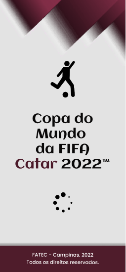

# Aplicativo da Copa do Mundo do Qatar 2022 ⚽

	

Desenvolvimento e Modelagem, utilizando Metodologia Ágil e ferramentas de gestão de processos de desenvolvimento e criação de Software, de um aplicativo para acompanhamento do Campeonato Mundial de Futebol: a Copa do Mundo 2022, no Qatar, para obtenção de nota e grau técnico, promovido pelo Prof° Anderson Luiz Barbosa, na matéria de Engenharia de Software.

Requisitos Funcionais da Aplicação:

	1) PERMITIR visualização dos países participantes;
	
	2) PERMITIR habilitar notificação dos jogos desejados;
	
	3) PERMITIR realização de Cadastro para novos usuários;
	
	4) PERMITIR realização de Login para usuários já previamente cadastrados;
	
	5) PERMITIR visualizar o jogo ao vivo;
	
	6) PERMITIR troca de idioma
	
	7) EXIBIR a tabela de classificação atual;
	
	8) EXIBIR informações sobre a Copa (país sede, história, etc.);
	
	9) EXIBIR informações dos times;
	
   	10) EXIBIR informações dos jogadores;
	
   	11) EXIBIR resultados dos jogos anteriores;
	
  	12) EXIBIR a grade de horários dos jogos;
	
   	13) EXIBIR feed de notícias sobre os jogos, jogadores, times, etc;
	
	14) EXIBIR Grupos dos Times
	
   	15) FILTRAR os jogos de determinada seleção.
   
Requisitos Não-Funcionais:

	1) A interface do aplicativo deve conter os fundamentos de Acessibilidade.
	
	2) A interface deve ser minimalista, porém contendo o essencial.
	
	3) Deve apresentar-se ao usuário de forma convidativa, apresentando um aspecto agradável.
	
	4) O sistema deve apresentar navegabilidade fluida, não contendo gargalos ou muita espera por requisições do usuário.
	
	5) O sistema deve ser compatível com o máximo de versões possíveis de dispositivos Android e IOS.
	
	6) O sistema deve ser intuitivo e exigir o mínimo possível de conhecimentos técnicos do usuário.
	
	7) Manutenções frequentes devem ser realizadas.
	
	8) Deve estar de acordo com a Lei Geral de Proteção de Dados - LGPD.
	
	9) Ter suporte e capacidade para inúmeros e múltiplos acessos de usuários pelo mundo.
	
	10) Deve conter todos os idiomas dos países presentes da copa

_Faculdade de Tecnologia (FATEC) de Campinas - ADS 2° Semestre - 2022_
